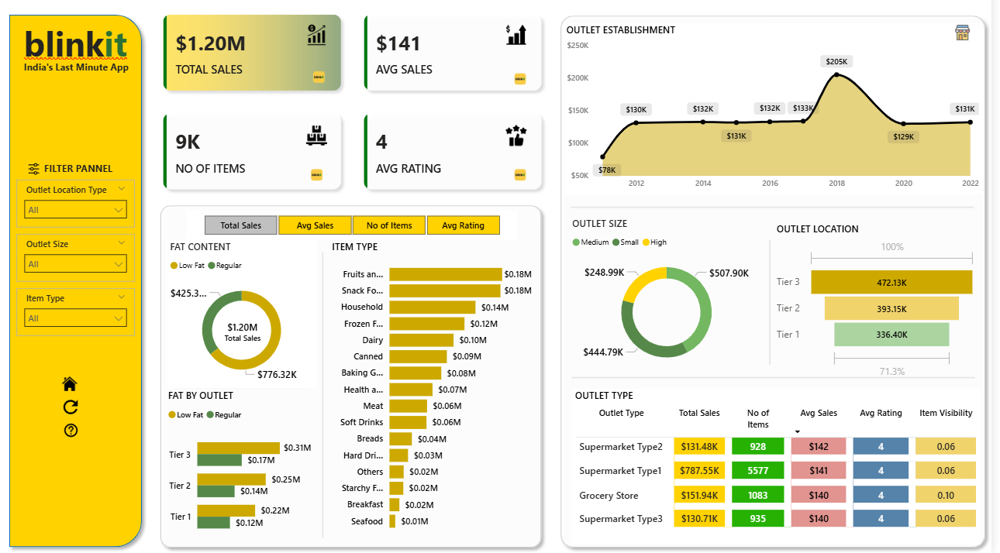

# Blinkit Sales Analysis – Power BI

## Project Overview
This Power BI dashboard analyzes Blinkit grocery sales data to understand
sales performance, item trends, outlet behavior, and customer ratings.

## Key Dashboards
- Sales Overview
- Item & Category Analysis
- Outlet Performance
- KPI Summary

## Dataset
- `BlinkIT_Grocery_Data.xlsx` – Grocery sales dataset

## Key Metrics
- Total Sales
- Average Sales
- Number of Items Sold
- Customer Ratings
- Outlet-wise performance

## Tools & Techniques
- Power BI Desktop
- Power Query for data cleaning
- DAX measures for KPIs
- Custom icons and background assets

## Visual Design
Custom icons and background images are applied directly inside the Power BI
report to enhance dashboard aesthetics and usability.

## Dashboard Preview

## File Information
- `Blinkit_Sales.pbix` – Final Power BI dashboard

## Notes
Power BI files cannot be previewed on GitHub. Download the `.pbix` file to
interact with the dashboard in Power BI Desktop.
